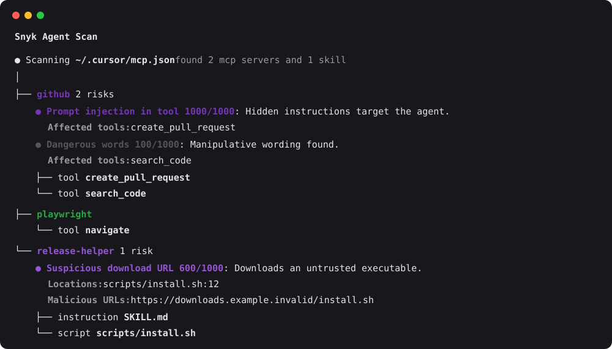

<p align="center">
  <h1 align="center">
  Snyk Agent Scan
  </h1>
</p>

<p align="center">
  Discover and scan agent components on your machine for prompt injections<br/>
  and vulnerabilities (including agents, MCP servers, skills).
</p>

> **Note: CLI output is experimental and subject to change**
>
> The raw output of this CLI — including issue codes, field names, severity labels, and response structure — is experimental and may change without notice between releases. We do not recommend building production workflows that depend on specific CLI output fields or issue codes.
>
> If you are an enterprise customer using Snyk to manage agent security risk at scale, the CLI output may not reflect what is sent to and shown in the Evo platform. The underlying integration, discovery, and risk assessment that powers enterprise deployments is stable and supported — any changes will be communicated in line with standard Snyk product practices. Contact your account team for deployment guidance.

> **NEW** Read our [technical report on the emerging threats of the agent skill eco-system](.github/reports/skills-report.pdf) published together with Agent Scan 0.4, which adds support for scanning agent skills.

<p align="center">
  <a href="https://pypi.python.org/pypi/snyk-agent-scan"></a>
  <a href="https://pypi.python.org/pypi/snyk-agent-scan"></a>
  <a href="https://pypi.python.org/pypi/snyk-agent-scan"></a>
</p>

<div align="center">
  
</div>

<br>

Agent Scan helps you discover all your installed agent components (harnesses, MCP servers, and skills) and scans them for common threats like prompt injections, sensitive data handling, or malware payloads hidden in natural language. Ignore analysis on skills by using `--no-skills`.

## Security Warning

> **⚠️ IMPORTANT: Scanning MCP configurations will execute the commands defined in them.**
>
> When Agent Scan scans an MCP configuration file, it starts the stdio MCP servers by executing the commands and arguments specified in the config. This is necessary to retrieve tool descriptions and perform security analysis.
>
> **Recommendations:**
> - **Run scans inside a sandbox** (Docker container, VM, or disposable environment) when evaluating untrusted or third-party MCP configs
> - **Review the consent prompt carefully** during interactive scans, it shows the exact command and arguments that will be executed for each server
> - **Use `--dangerously-run-mcp-servers`** only in trusted environments where you've verified all MCP server commands
>
> By default, Agent Scan requires explicit user consent (y/n) before starting each stdio MCP server during interactive runs. This gives you control over what gets executed on your system.

## Quick Start

Choose one of two ways to run Agent Scan:

1. **Run the Python package with `uvx`** using the instructions below.
2. **Download a standalone binary** for your platform from [GitHub Releases](https://github.com/snyk/agent-scan/releases). Releases also include the SBOM, checksums, signed checksums, and source code archives.

Before using either option:

1. **Sign up at [Snyk](https://snyk.io)** and get an API token from [https://app.snyk.io/account](https://app.snyk.io/account) (API Token → KEY → click to show).
2. **Set the token as an environment variable** before running any scan:
   ```bash
   export SNYK_TOKEN=your-api-token-here
   ```

### Run with `uvx`

Have [uv](https://docs.astral.sh/uv/getting-started/installation/) installed on your system, then run a full scan of your machine (auto-discovers agents, MCP servers, and skills):

```bash
uvx snyk-agent-scan@latest
```

This will scan for security vulnerabilities in MCP servers, tools, prompts, and resources. It will automatically discover a variety of agent configurations, including Claude Code/Desktop, Cursor, Gemini CLI, and Windsurf.

You can also scan particular MCP configuration files or skills:

```bash
# scan a specific mcp configuration
uvx snyk-agent-scan@latest ~/.vscode/mcp.json
# scan a single agent skill
uvx snyk-agent-scan@latest ~/path/to/my/SKILL.md
# scan all claude skills
uvx snyk-agent-scan@latest ~/.claude/skills
```

### Run with a standalone binary

Download the binary for your operating system and architecture from the [latest GitHub Release](https://github.com/snyk/agent-scan/releases/latest). The release page also provides an SBOM (`sbom-<version>.json`), checksum files, and GitHub-generated source code archives. See [Verifying Standalone Binaries](#verifying-standalone-binaries) to verify your download.

### Example Run

[](https://asciinema.org/a/716858)

## Highlights

- Auto-discover MCP configurations, agent tools, skills
- Scanning of Claude, Cursor, Windsurf, Gemini CLI, Amp, Amazon Q, and other agents.
- Detects [15+ distinct security risks](docs/issue-codes.md) across MCP servers and agent skills:
  - MCP: [Prompt Injection](docs/issue-codes.md#E001), [Tool Poisoning](docs/issue-codes.md#E001), [Tool Shadowing](docs/issue-codes.md#E002), [Toxic Flows](docs/issue-codes.md#ToxicFlows)
  - Skills: [Prompt Injection](docs/issue-codes.md#E004), [Malware Payloads](docs/issue-codes.md#E006), [Untrusted Content](docs/issue-codes.md#W011), [Credential Handling](docs/issue-codes.md#W007), [Hardcoded Secrets](docs/issue-codes.md#W008)

## Supported agents and capabilities

Agent Scan auto-discovers agents and their capabilities (MCP servers or skills) when their install paths exist. The table below shows on which operating systems each agent is scanned.

- **✓**: at least one path is defined for that capability.
- **✗**: the agent is listed for that OS but has no paths for that capability.
- **—**: that agent is not included for that OS.
- **Skills** Skills can be ignored by using `--no-skills`

| Agent | macOS MCP | macOS Skills | Linux MCP | Linux Skills | Windows MCP | Windows Skills |
| --- | :---: | :---: | :---: | :---: | :---: | :---: |
| Windsurf | ✓ | ✓ | ✓ | ✓ | ✓ | ✓ |
| Cursor | ✓ | ✓ | ✓ | ✓ | ✓ | ✓ |
| VS Code | ✓ | ✓ | ✓ | ✓ | ✓ | ✓ |
| Claude Desktop | ✓ | ✗ | — | — | ✓ | ✗ |
| Claude Code | ✓ | ✓ | ✓ | ✓ | ✓ | ✓ |
| Gemini CLI | ✓ | ✓ | ✓ | ✓ | ✓ | ✓ |
| OpenClaw | ✗ | ✓ | ✗ | ✓ | ✗ | ✓ |
| Amp | ✗ | ✓ | ✗ | ✓ | ✗ | ✓ |
| Kiro | ✓ | ✓ | ✓ | ✓ | ✓ | ✓ |
| OpenCode | ✓ | ✓ | ✓ | ✓ | ✓ | ✓ |
| Antigravity | ✓ | ✓ | ✓ | ✓ | ✓ | ✓ |
| Codex | ✓ | ✓ | ✓ | ✓ | — | — |
| Amazon Q | ✓ | ✗ | ✓ | ✗ | ✓ (WSL) | ✗ |

### Detection coverage by scope

The matrix above shows on which operating systems each agent is scanned. This one breaks detection down by **configuration scope** and **component type** (skills vs MCP servers), combined across operating systems. "Servers" means MCP servers.

The four scopes:

- **System** — machine-wide / admin-managed / enterprise config that applies to all users (e.g. `managed-mcp.json`, files under `/etc`, `/Library/Application Support`, or `ProgramData`).
- **User** — the user's home-directory config (applies across all their projects).
- **Project / workspace** — config scoped to an opened project or workspace.
- **Extension / plugin** — components bundled inside installed extensions or plugins.

Legend: **✓** detected · **✗** the agent supports this but Agent Scan does not scan it yet · **N/A** the agent has no such component at this scope.

| Agent | System<br>skills | System<br>servers | User<br>skills | User<br>servers | Project / WS<br>skills | Project / WS<br>servers | Ext / plugin<br>skills | Ext / plugin<br>servers |
| --- | :---: | :---: | :---: | :---: | :---: | :---: | :---: | :---: |
| Windsurf | ✓ | N/A | ✓ | ✓ | ✓ | ✓ | ✓ | ✓ |
| Cursor | N/A | N/A | ✓ | ✓ | ✓ | ✓ | ✓ | ✓ |
| VS Code | N/A | N/A | ✓ | ✓ | ✓ | ✓ | ✓ | ✓ |
| Claude Desktop | N/A | N/A | ✗ | ✓ | N/A | N/A | N/A | ✗ |
| Claude Code | ✗ | ✓ | ✓ | ✓ | ✓ | ✓ | ✓ | ✓ |
| Gemini CLI | N/A | ✗ | ✓ | ✓ | ✗ | ✗ | ✗ | ✗ |
| OpenClaw | N/A | N/A | ✓ | ✗ | ✓ † | N/A | ✗ | ✗ |
| Amp | N/A | ✗ | ✓ | ✗ | ✗ ‡ | ✗ | ✗ | ✗ |
| Kiro | N/A | N/A | ✓ | ✓ | ✓ | ✓ | ✓ | ✓ |
| OpenCode | ✓ | ✓ | ✓ | ✓ | ✓ | ✓ | N/A | N/A |
| Antigravity | N/A | N/A | ✓ | ✓ | ✓ | ✓ | ✓ | ✓ |
| Codex | ✓ | ✓ | ✓ | ✓ | ✓ | ✓ | ✓ | ✓ |
| Amazon Q | N/A | N/A | N/A | ✓ | N/A | ✗ | N/A | N/A |

† OpenClaw has no opened-project enumeration: its project/workspace skills are found only at the fixed `~/.openclaw/workspace/skills`

‡ Amp stores project/workspace skills at `.agents/skills` (and the `.claude/skills` compatibility path); only the user-scope `~/.config/agents/skills` is detected today, so project-scope skills are supported but not yet scanned.

## Verifying Standalone Binaries

We use GPG signing on the release checksums file to ensure distribution integrity and authenticity.

### Step-by-Step Verification Guide

1. **Download the release assets:**
   Download the binary for your platform (e.g., `agent-scan-<version>-<os>-<arch>`) and the signed checksums file (`sha256sums.txt.asc`) from the [GitHub Releases](https://github.com/snyk/agent-scan/releases) page into the same directory.

2. **Verify GPG signature of the checksums file:**
   Download the [GPG public key](https://github.com/snyk/agent-scan/blob/main/help/_about-this-project/snyk-code-signing-public.pgp) into the same directory, then run:
   ```bash
   gpg --import snyk-code-signing-public.pgp
   gpg --verify sha256sums.txt.asc
   ```
   Look for a line in the output saying `gpg: Good signature from "Snyk Limited <code-signing@snyk.io>"`.

3. **Verify the binary's integrity:**
   After confirming the signature is valid, check that your downloaded binary matches the checksum:
   * **On Linux (or macOS with `coreutils`):**
     ```bash
     grep agent-scan-<version>-<os>-<arch> sha256sums.txt.asc | sha256sum -c -
     ```
   * **On macOS (using default `shasum`):**
     ```bash
     grep agent-scan-<version>-<os>-<arch> sha256sums.txt.asc | shasum -a 256 -c -
     ```
   This will output `agent-scan-<version>-<os>-<arch>: OK`.

## Scanner Capabilities

Agent Scan is a security scanning tool to both scan and inspect the supply chain of agent components on your machine. It scans for common security vulnerabilities like prompt injections, tool poisoning, toxic flows, or vulnerabilities in agent skills.

Agent Scan operates in two main modes which can be used jointly or separately:

1. **Scan Mode**: The CLI command `snyk-agent-scan` scans the current machine for agents and agent components such as skills and MCP servers. Upon completion, it will output a comprehensive report for the user to review.

2. **Background Mode** (MDM). Agent Scan scans the machine in regular intervals in the background, and reports the results to a [Snyk Evo](https://evo.ai.snyk.io) instance. This can be used by security teams to monitor the company-wide agent supply chain in a central location. To set this up, please [contact us](https://evo.ai.snyk.io/#contact-us).

## How It Works

### Scanning

Agent Scan searches through your local agent's configuration files to find agents, skills, and MCP servers. For MCP, it connects to servers and retrieves tool descriptions.

#### Interactive Consent for MCP Servers

> **⚠️ Security Note**: Scanning an MCP config executes the commands defined in it. Always review what will be executed before approving.

By default, Agent Scan prompts for user consent before starting each stdio MCP server during interactive runs. This consent flow:

- Shows the server name, command, and environment variables (redacted) that will be executed
- Allows you to approve or decline each server individually
- Prevents potentially untrusted servers from running without your explicit permission
- Records declined servers with a `user_declined` error (they are never started)

**Best Practices:**
- Review the command and arguments carefully before approving
- When scanning untrusted or third-party MCP configs, run Agent Scan inside a sandbox (Docker, VM, or disposable environment)
- Decline any servers with unfamiliar or suspicious commands

For non-interactive environments (e.g., CI/CD pipelines), you must use the `--dangerously-run-mcp-servers` flag to bypass the consent prompt and start all servers automatically. **Only use this flag in trusted environments where all MCP server commands have been verified.**

#### Analysis and Validation

Agent Scan validates the components, both with local checks and by invoking the Agent Scan API. For this, skills, agent applications, tool names, and descriptions are shared with Snyk. By using Agent Scan, you agree to the Snyk [terms of use for Agent Scan](./TERMS.md).

Agent Scan does not store or log any usage data, i.e. the contents and results of your MCP tool calls.

## CLI Parameters

Agent Scan provides the following commands:

```
snyk-agent-scan - Security scanner for agents, MCP servers, and skills
```

### Common Options

These options are available for all commands:

```
--storage-file FILE    Path to store scan results and scanner state (default: ~/.mcp-scan)
--base-url URL         Base URL for the verification server
--verbose              Enable detailed logging output
--print-errors         Show error details and tracebacks
--json                 Output results in JSON format instead of rich text
```

### Commands

#### scan (default)

Scan MCP configurations for security vulnerabilities in tools, prompts, and resources.

```
snyk-agent-scan scan [CONFIG_FILE...]
```

Options:

```
--checks-per-server NUM           Number of checks to perform on each server (default: 1)
--server-timeout SECONDS          Seconds to wait before timing out server connections (default: 10)
--suppress-mcpserver-io BOOL      Suppress stderr from stdio MCP servers (stdout carries the JSON-RPC protocol
                                  and is never shown). Default: False for interactive runs (stderr is streamed
                                  with a [server-name] prefix), True otherwise.
--dangerously-run-mcp-servers     ⚠️ DANGER: Skip the interactive consent prompt and automatically start every
                                  stdio MCP server listed in the scanned configs. Only use in trusted
                                  environments where you've verified all MCP server commands.
--no-skills                       Skip analysis on skills.
```

#### inspect

Print descriptions of tools, prompts, and resources without verification.

```
snyk-agent-scan inspect [CONFIG_FILE...]
```

Options:

```
--server-timeout SECONDS          Seconds to wait before timing out server connections (default: 10)
--suppress-mcpserver-io BOOL      Suppress stderr from stdio MCP servers (stdout carries the JSON-RPC protocol
                                  and is never shown). Default: False for interactive runs (stderr is streamed
                                  with a [server-name] prefix), True otherwise.
--dangerously-run-mcp-servers     ⚠️ DANGER: Skip the interactive consent prompt and automatically start every
                                  stdio MCP server listed in the scanned configs. Only use in trusted
                                  environments where you've verified all MCP server commands.
```

#### help

Display detailed help information and examples.

```bash
snyk-agent-scan help
```

### Examples

```bash
# Scan all known MCP configs and agent skills
snyk-agent-scan

# Scan a specific config file
snyk-agent-scan ~/custom/config.json

# Scan a specific skill file
snyk-agent-scan ~/path/to/my/SKILL.md

# Scan a directory for skills
snyk-agent-scan ~/.claude/skills

# Just inspect tools without verification
snyk-agent-scan inspect

# Skip consent prompts and run all servers (ONLY for CI/CD or fully trusted environments)
snyk-agent-scan --dangerously-run-mcp-servers

# Suppress MCP server stderr output during scanning
snyk-agent-scan --suppress-mcpserver-io=true

# CI mode (requires --dangerously-run-mcp-servers in non-interactive environments)
snyk-agent-scan --ci --dangerously-run-mcp-servers
```

## Demo

This repository includes a vulnerable MCP server that can demonstrate Model Context Protocol security issues that Agent Scan finds.

How to demo MCP security issues?

1. Clone this repository
2. Create an `mcp.json` config file in the cloned git repository root directory with the following contents:

```jsonc
{
  "mcpServers": {
    "Demo MCP Server": {
      "type": "stdio",
      "command": "uv",
      "args": ["run", "mcp", "run", "demoserver/server.py"],
    },
  },
}
```

3. Run Agent Scan: `uvx --python 3.13 snyk-agent-scan@latest scan --full-toxic-flows mcp.json`

Note: if you place the `mcp.json` configuration filepath elsewhere then adjust the `args` path inside the MCP server configuration to reflect the path to the MCP Server (`demoserver/server.py`) as well as the `uvx` command that runs Agent Scan with the correct filepath to `mcp.json`.

## Agent Scan is closed to contributions

Agent Scan does not accept external contributions at this time.

We welcome suggestions, bug reports, or feature requests as GitHub issues.

## Development Setup

To run Agent Scan from source, follow these steps:

```bash
uv run pip install -e .
uv run -m src.agent_scan.cli
```

## Including Agent Scan results in your own project / registry

If you want to include Agent Scan results in your own project or registry, please [reach out](https://evo.ai.snyk.io/#contact-us). There are designated APIs for this purpose. Using the standard Agent Scan API for large scale scanning is considered abuse and will result in your account being blocked.

## Documentation

- [CLI reference](docs/cli-reference.md) — All commands, flags, options, and environment variables.
- [Scanning](docs/scanning.md) — How scanning works and usage examples.
- [JSON output](docs/json-output.md) — JSON schema and programmatic parsing.
- [Issue Codes](docs/issue-codes.md) — Reference for all security issues detected by Agent Scan.

## Further Reading

- [Introducing MCP-Scan](https://invariantlabs.ai/blog/introducing-mcp-scan)
- [MCP Security Notification Tool Poisoning Attacks](https://invariantlabs.ai/blog/mcp-security-notification-tool-poisoning-attacks)
- [WhatsApp MCP Exploited](https://invariantlabs.ai/blog/whatsapp-mcp-exploited)
- [MCP Prompt Injection](https://simonwillison.net/2025/Apr/9/mcp-prompt-injection/)
- [Toxic Flow Analysis](https://invariantlabs.ai/blog/toxic-flow-analysis)
- [Skills Report](.github/reports/skills-report.pdf)

## Changelog

See [CHANGELOG.md](CHANGELOG.md).
