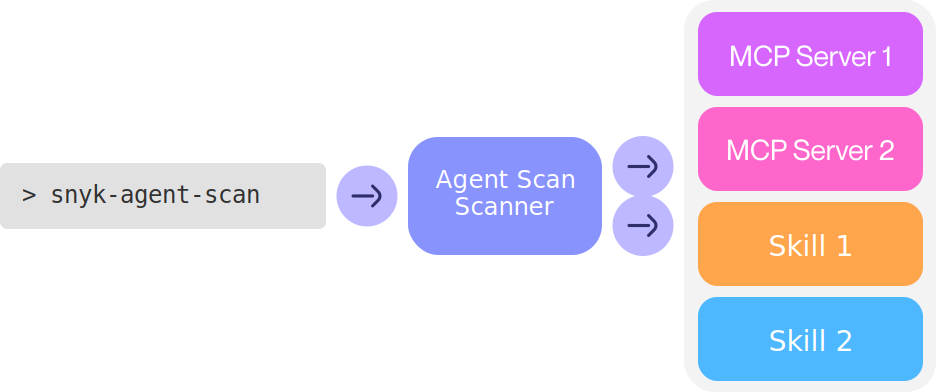

# Scanning with `snyk-agent-scan`

Scan your machine for agents, MCP servers, and skills, and detect security vulnerabilities like prompt injections, tool poisoning, toxic flows, or malware payloads. See the [Issue Code Reference](issue-codes.md) for a full list of detected issues.

Agent Scan operates in two main modes which can be used jointly or separately:

1. **Scan Mode**: The CLI command `snyk-agent-scan` scans the current machine for agents and agent components such as skills and MCP servers. Upon completion, it will output a comprehensive report for the user to review.

2. **Background Mode** (MDM, Crowdstrike): Agent Scan scans the machine in regular intervals in the background, and reports the results to a [Snyk Evo](https://evo.ai.snyk.io) instance. This can be used by security teams to monitor the company-wide agent supply chain in a central location. To set this up, please [contact us](https://evo.ai.snyk.io/#contact-us).

## Quick Start

To run a full scan of your machine (auto-discovers agents, MCP servers, skills), run:

```bash
uvx snyk-agent-scan@latest --skills
```

This will scan for security vulnerabilities in servers, skills, tools, prompts, and resources. It will automatically discover a variety of agent configurations, including Claude Code/Desktop, Cursor, Gemini CLI, and Windsurf.

You can also scan particular configuration files or skills:

```bash
# scan mcp configurations
uvx snyk-agent-scan@latest ~/.vscode/mcp.json
# scan a single agent skill
uvx snyk-agent-scan@latest  --skills ~/path/to/my/SKILL.md
# scan all claude skills
uvx snyk-agent-scan@latest  --skills ~/.claude/skills
```

## How It Works



Agent Scan searches through your local agent's configuration files to find agents, skills, and MCP servers. For MCP, it connects to servers and retrieves tool descriptions. Omit `--skills` to skip skill analysis.

It then validates the components, both with local checks and by invoking the Agent Scan API. For this, skills, agent applications, tool names, and descriptions are shared with Snyk. By using Agent Scan, you agree to the Snyk [terms of use for Agent Scan](../TERMS.md).

Agent Scan does not store or log any usage data, i.e. the contents and results of your MCP tool calls.

## CLI Parameters

```
snyk-agent-scan - Security scanner for agents, MCP servers, and skills
```

### Common Options

These options are available for all commands:

```
--storage-file FILE    Path to store scan results and scanner state (default: ~/.mcp-scan)
--base-url URL         Base URL for the verification server
--verbose              Enable detailed logging output
--print-errors         Show error details and tracebacks
--full-toxic-flows     Show all tools that could take part in toxic flow. By default only the top 3 are shown.
--json                 Output results in JSON format instead of rich text
```

### Commands

#### scan (default)

Scan MCP configurations for security vulnerabilities in tools, prompts, and resources.

```
snyk-agent-scan scan [CONFIG_FILE...]
```

Options:

```
--checks-per-server NUM           Number of checks to perform on each server (default: 1)
--server-timeout SECONDS          Seconds to wait before timing out server connections (default: 10)
--suppress-mcpserver-io BOOL      Suppress stdout/stderr from MCP servers (default: True)
--skills                          Autodetects and analyzes skills
--skills PATH_TO_SKILL_MD_FILE    Analyzes the specific skill
--skills PATHS_TO_DIRECTORY       Recursively detects and analyzes all skills in the directory
```

#### inspect

Print descriptions of tools, prompts, and resources without verification.

```
snyk-agent-scan inspect [CONFIG_FILE...]
```

Options:

```
--server-timeout SECONDS      Seconds to wait before timing out server connections (default: 10)
--suppress-mcpserver-io BOOL  Suppress stdout/stderr from MCP servers (default: True)
```

#### help

Display detailed help information and examples.

```bash
snyk-agent-scan help
```

### Examples

```bash
# Scan all known MCP configs
snyk-agent-scan

# Scan a specific config file
snyk-agent-scan ~/custom/config.json

# Just inspect tools without verification
snyk-agent-scan inspect
```
