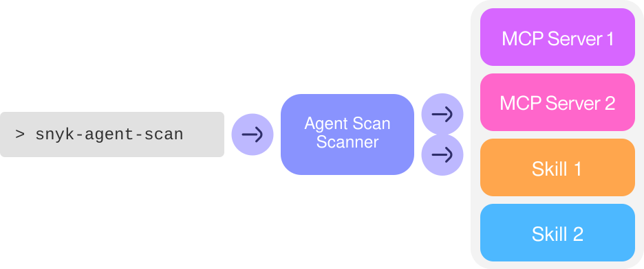

# Scanning with `snyk-agent-scan`

Scan your machine for agents, MCP servers, and skills, and detect security vulnerabilities like prompt injections, tool poisoning, toxic flows, or malware payloads. See the [Issue Code Reference](issue-codes.md) for a full list of detected issues.

Agent Scan operates in two main modes which can be used jointly or separately:

1. **Scan Mode**: The CLI command `snyk-agent-scan` scans the current machine for agents and agent components such as skills and MCP servers. Upon completion, it will output a comprehensive report for the user to review.

2. **Background Mode** (MDM): Agent Scan scans the machine in regular intervals in the background, and reports the results to a [Snyk Evo](https://evo.ai.snyk.io) instance. This can be used by security teams to monitor the company-wide agent supply chain in a central location. To set this up, please [contact us](https://evo.ai.snyk.io/#contact-us).

## Quick Start

To run a full scan of your machine (auto-discovers agents, MCP servers, skills), run:

```bash
uvx snyk-agent-scan@latest --skills
```

This will scan for security vulnerabilities in servers, skills, tools, prompts, and resources. It will automatically discover a variety of agent configurations, including Claude Code/Desktop, Cursor, Gemini CLI, and Windsurf.

You can also scan particular configuration files or skills:

```bash
# scan mcp configurations
uvx snyk-agent-scan@latest ~/.vscode/mcp.json
# scan a single agent skill
uvx snyk-agent-scan@latest  --skills ~/path/to/my/SKILL.md
# scan all claude skills
uvx snyk-agent-scan@latest  --skills ~/.claude/skills
```

## How It Works



Agent Scan searches through your local agent's configuration files to find agents, skills, and MCP servers. For MCP, it connects to servers and retrieves tool descriptions. Omit `--skills` to skip skill analysis.

It then validates the components, both with local checks and by invoking the Agent Scan API. For this, skills, agent applications, tool names, and descriptions are shared with Snyk. By using Agent Scan, you agree to the Snyk [terms of use for Agent Scan](../TERMS.md).

Agent Scan does not store or log any usage data, i.e. the contents and results of your MCP tool calls.

## CLI Parameters

For the complete, up-to-date list of commands, flags, options, environment variables, and exit codes, see **[CLI reference](cli-reference.md)**.

Quick summary:

- **Default command:** `scan` (omit the subcommand to scan well-known agent configs)
- **`inspect`:** discovery and MCP handshake only — no security analysis
- **`--skills` / `--no-skills`:** skills are scanned by default; use `--no-skills` for MCP-only
- **`--ci`:** non-zero exit on findings (requires `--dangerously-run-mcp-servers` in CI)
- **`--json`:** machine-readable output — see [JSON output](json-output.md)

### Examples

```bash
# Scan all known MCP configs and agent skills
snyk-agent-scan

# Scan a specific config file
snyk-agent-scan ~/custom/config.json

# Just inspect tools without verification
snyk-agent-scan inspect

# CI mode
snyk-agent-scan --ci --dangerously-run-mcp-servers
```
